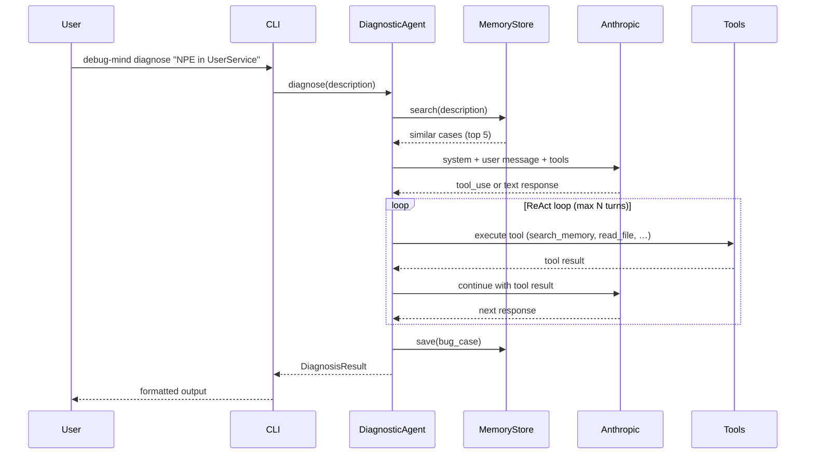
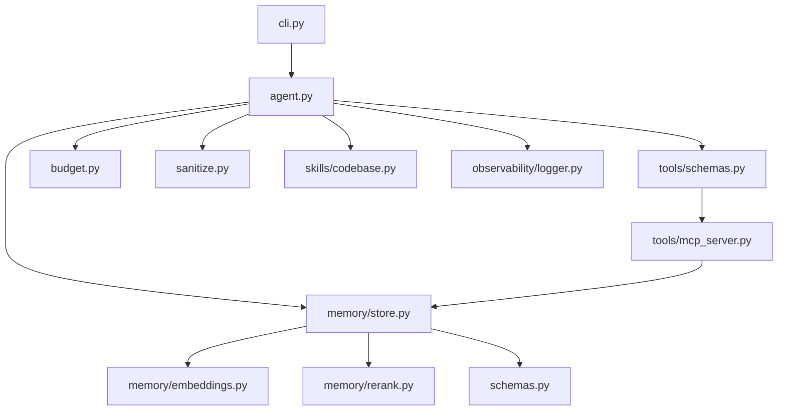

# Architecture

> Who this is for: contributors who need to understand how DebugMind is wired together.

## Request flow

## Module dependency graph

## Module responsibilities

| Module | Role |
|--------|------|
| `cli.py` | Click CLI (diagnose, search, list, stats, show, delete, rebuild, serve, audit, doctor) |
| `agent.py` | ReAct loop: build messages, dispatch tools, handle API responses, orchestrate diagnosis |
| `schemas.py` | Pydantic models: BugCase, SearchResult, DiagnosisResult, MemoryStats |
| `memory/store.py` | Persistent bug case store: save, search, get, verify, delete, mark_used, rebuild_index, doctor |
| `memory/embeddings.py` | Pluggable embedding functions (default/voyage/openai/bge) |
| `memory/rerank.py` | Search result reranking (identity, LLM-based) |
| `tools/schemas.py` | Single source of truth for Anthropic tool definitions |
| `tools/mcp_server.py` | MCP server exposing memory tools to AI editors |
| `skills/codebase.py` | Codebase tools: list_project_structure, search_code, read_file |
| `budget.py` | Token/cost budget with price table and env-configurable limits |
| `sanitize.py` | Input sanitization: truncation, control char stripping, tag limits |
| `observability/logger.py` | Structured logging (JSON/text) with optional OTel hook |

## Design principles

- **Memory-first**: every diagnosis is saved and reused for future queries
- **Single source of truth**: tool schemas defined once in `schemas.py`, shared by agent and MCP
- **Pluggable**: embedding and reranker backends are swappable via env vars
- **Offline evaluation**: `debug-mind eval --search-only` runs without API keys for quick feedback
